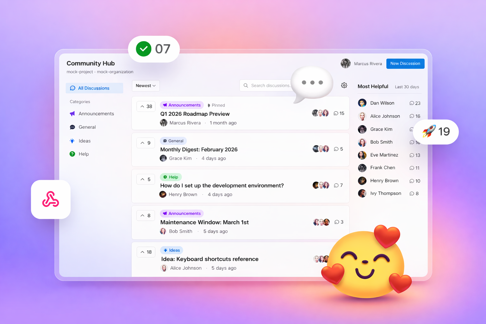

## The home for team conversations in Azure DevOps

Ask questions, share announcements, upvote ideas, and comment—all right next to your work. Community Hub enables healthy and productive team collaboration within Azure DevOps.

[Get Started](#quick-start) · [Report Issue](https://marketplace.visualstudio.com/items?itemName=Repryl.community-hub&ssr=false#qna)

---

## Dedicated space for conversations

Decrease the burden of managing communication in work items by providing a separate space to host ongoing discussions, announcements, and team updates.

- **Announcements** — Create official communications that stay visible. Pin critical updates to the top so they never get lost.
- **Comments** — Maintain focused conversations with chronological, Markdown-rendered comments.
- **Upvoting** — Let team members show support for discussions. Sort by top voted to surface important topics.
- **Labels & Filtering** — Categorize with custom labels. Filter by label, sort by newest, top voted, or most active.

---

## Customize

Personalize Community Hub for your team with features that make your space unique for you and your collaborators.

- **Custom labels.** Create labels that fit your team's workflow and categorization needs.
- **Organize and filter.** Keep discussions tidy and make it easy for your team to find relevant topics.
- **Pin discussions.** Make announcements and important discussions more visible for everyone.
- **Control visibility.** Choose whether discussions stay within your project, span the organization, or reach specific cross-project teams.

---

## Rich content support

Write expressive discussions and comments with full Markdown support.

| Feature                              | Support |
| ------------------------------------ | ------- |
| Headers, bold, italic, strikethrough | ✓       |
| Ordered & unordered lists            | ✓       |
| Code blocks with syntax highlighting | ✓       |
| Tables                               | ✓       |
| Blockquotes                          | ✓       |
| Links                                | ✓       |

---

## Flexible visibility

Control who sees your discussions with granular visibility settings.

| Visibility            | Description                             |
| --------------------- | --------------------------------------- |
| **Project Only**      | Visible only within the current project |
| **Organization-wide** | Visible to all organization members     |
| **Cross-Project**     | Share with specific selected projects   |

---

## Stay organized

Find what matters with powerful sorting and filtering options.

| Sort by         | Description                        |
| --------------- | ---------------------------------- |
| **Newest**      | Most recently created discussions  |
| **Top voted**   | Discussions with the most upvotes  |
| **Most active** | Discussions with the most comments |

Filter by labels, search by title, and quickly navigate to the content you need.

---

## Discussion detail view

Each discussion provides a dedicated space for in-depth conversation:

- Full Markdown-rendered content
- Upvote count and voting
- Chronological comments
- Labels and visibility indicators
- Edit and moderation controls for admins

---

## Quick start

### Prerequisites

- Azure DevOps organization with an inherited process
- Project Collection Administrator permissions (for initial setup)

### Installation

1. Install the Community Hub extension from the [Azure DevOps Marketplace](https://marketplace.visualstudio.com/items?itemName=Repryl.community-hub)
2. Configure the required `Discussion` work item type
3. Apply the configured process to your target projects
4. Access Community Hub from the top-level navigation in your project

---

## Technical requirements

### Supported environments

- Azure DevOps Services (cloud)
- Azure DevOps Server 2020+

### Required OAuth scopes

| Scope            | Purpose                           |
| ---------------- | --------------------------------- |
| `vso.work_write` | Create and manage discussions     |
| `vso.project`    | Read project information          |
| `vso.profile`    | Read user profile for permissions |

---

  <b>Start the conversation with your team</b> 
  <a href="docs/ADMIN_SETUP_GUIDE.md">Get Started →</a>

